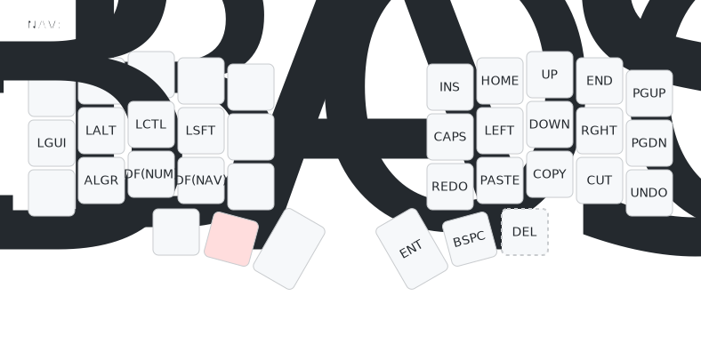
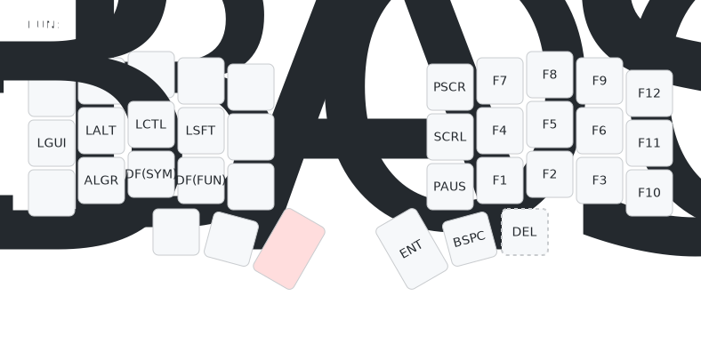
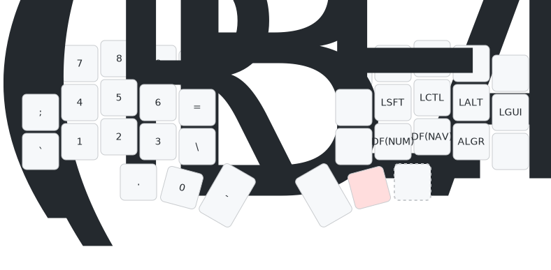
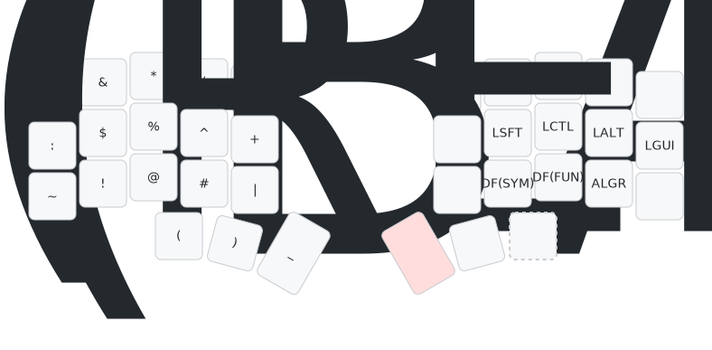
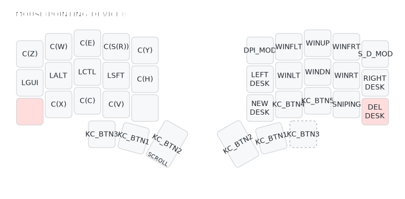
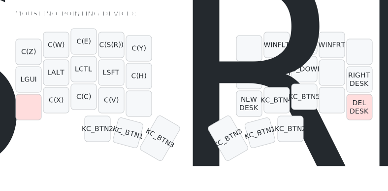

# 레이어 소개
제가 사용 하는 레이어를 소개합니다.

## 목차
> [기본 레이어](#기본-레이어)  
> [이동 레이어](#이동-레이어)  
> [기능 레이어](#기능-레이어)  
> [숫자 레이어](#숫자-레이어)  
> [특문 레이어](#특문-레이어)  
> [마우스 레이어-트랙볼 지원](#마우스-레이어-트랙볼-지원)  
> [마우스 레이어-트랙볼 미지원](#마우스-레이어-트랙볼-미지원)  

### 기본 레이어

- 상세내용 작성 필요

### 이동 레이어

- 상세내용 작성 필요

### 기능 레이어

- 상세내용 작성 필요

### 숫자 레이어

- 상세내용 작성 필요

### 특문 레이어

- 상세내용 작성 필요

### 마우스 레이어-트랙볼 지원

- 상세내용 작성 필요

### 마우스 레이어-트랙볼 미지원

- 상세내용 작성 필요